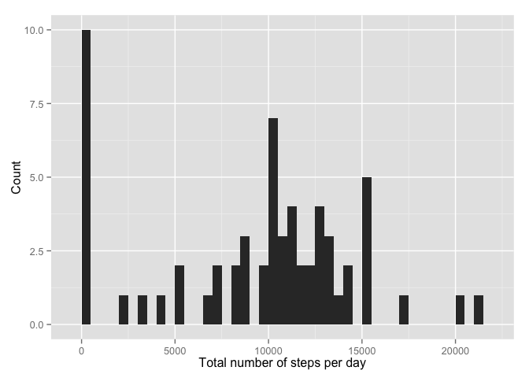
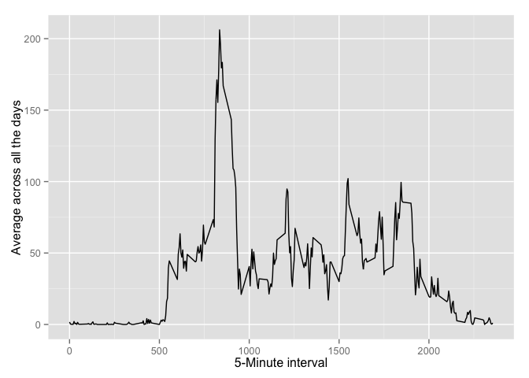
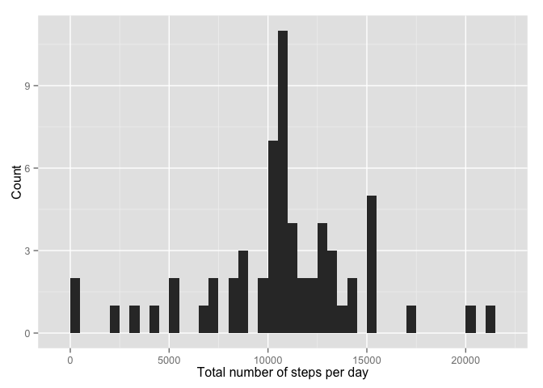
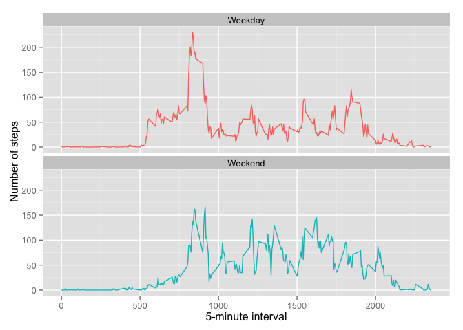

# Reproducible Research: Peer Assessment 1


## Loading and preprocessing the data

Download the data if it does not already exist


```r
fileUrl="https://d396qusza40orc.cloudfront.net/repdata%2Fdata%2Factivity.zip"
#Download the files and unzip it
if (!file.exists("activity.zip")) {
    download.file(fileUrl, method = "curl", destfile = "activity.zip")
}

if (!file.exists("activity.csv")) {
    unzip("activity.zip")
}
```

Read the data from the **activity.csv** file and convert the dates into R **Date** format


```r
#Read the data
activityData <- read.csv("activity.csv",stringsAsFactors=FALSE)
activityData$date <- as.Date(activityData$date,"%Y-%m-%d")
```

Quick summary of the data

```r
summary(activityData)
```

```
##      steps             date               interval     
##  Min.   :  0.00   Min.   :2012-10-01   Min.   :   0.0  
##  1st Qu.:  0.00   1st Qu.:2012-10-16   1st Qu.: 588.8  
##  Median :  0.00   Median :2012-10-31   Median :1177.5  
##  Mean   : 37.38   Mean   :2012-10-31   Mean   :1177.5  
##  3rd Qu.: 12.00   3rd Qu.:2012-11-15   3rd Qu.:1766.2  
##  Max.   :806.00   Max.   :2012-11-30   Max.   :2355.0  
##  NA's   :2304
```

## What is mean total number of steps taken per day?
Make a histogram of the total number of steps taken each day  


```r
library(ggplot2)

total.steps<-tapply(activityData$steps, activityData$date, 
                    FUN = sum, na.rm = TRUE)

qplot(total.steps,binwidth = 500,xlab="Total number of steps per day",ylab="Count")
```

 

Calculate and report the mean and median total number of steps taken per day  


```r
library(scales) # for comma function
mean.raw <- mean(total.steps)
median.raw <- median(total.steps)
```
Rounded Mean and Median values  
Mean Steps   = **9,354**  
Median Steps = **10,395**

## What is the average daily activity pattern?

Average number of steps taken across all days  

```r
intervalActivity <- tapply(activityData$steps, activityData$interval, mean, na.rm = TRUE)

qplot( as.numeric(names(intervalActivity)),intervalActivity, geom="line",
       xlab="5-Minute interval",ylab="Average across all the days")
```

 

5-minute interval, on average across all the days in the dataset, that contains the maximum number of steps.


```r
maxSteps <- max(intervalActivity)
intervalName <- which(intervalActivity==maxSteps)
```

The average max number of steps is **206.1698113** which is for the interval **104** across all days.

## Imputing missing values
Calculate and report the total number of missing values in the dataset (i.e. the total number of rows with NAs)


```r
missingValues<-length(activityData$steps) - sum(complete.cases(activityData))
```

There are **2304** missing values in the dataset.

Fill in the missing values using mean for the interval across all days

```r
#intervalActivity
newData <- activityData

indexOfNA <- which(is.na(newData$steps))
newData$steps[indexOfNA] <- intervalActivity[as.character(newData$interval[indexOfNA])]


total.steps.new<-tapply(newData$steps, newData$date, FUN = sum)
```

Creat a Histogram for the new dataset (filled in data)

```r
qplot(total.steps.new,binwidth = 500,xlab="Total number of steps per day",ylab="Count")
```

 

Calculate the new mean and medians 

```r
mean.new <- mean(total.steps.new)
median.new <- median(total.steps.new)
```

Rounded new Mean and Median values based on imputed data.  
Mean Steps   = **10,766**  
Median Steps = **10,766**

Both the **Mean** and **Median** values have gone up in the imputed dataset. 


## Are there differences in activity patterns between weekdays and weekends?

Lets find if a day is a weekday or weekend  

```r
newData$day <- format(newData$date,"%a")
newData$weekend <- as.factor(ifelse(newData$day == "Sat" | newData$day == "Sun","Weekend","Weekday"))
```

Lets create a panel plot to compare the two charts (weekday and weekend).   

```r
avgSteps <- aggregate(steps ~ interval + weekend, data = newData,FUN=mean)

ggplot(data=avgSteps,aes(y=steps,x=interval,colour=weekend)) + geom_line() + 
    facet_wrap(~weekend,ncol=1) + #facet_grid(weekend~.) +
    xlab("5-minute interval") + ylab("Number of steps") +
    theme(legend.position="none")
```

 
   
From the chart its clear that there is more walking around on weekends when comared to weekdays.

